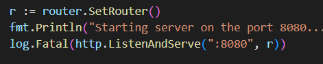

# DCARD_2024Backend_intern_HW:API

## 基本功能
這是廣告投放服務，一個是廣告寫入、一個是查詢相對應條件的廣告。

兩個API:
    
1. Admin API:新增廣告與相關條件，這是以POST方式寫入。
    
    > API:http://<host>/api/v1/ad
    
    * 每個廣告有:

        1. Title:廣告標題。
        2. StartAt、EndAt:顯示廣告的時間區間。
        3. Conditions:顯示條件，每個廣告都可以不設定，就代表不限制。
            * Age: <1~100>
            * Gender: <enum：M、F>
            * Country: <enum：TW、JP 等符合 "https://zh.wikipedia.org/wiki/ISO_3166-1" >
            * Platform: <enum：android, ios, web>

2. Public API:使用GET取得廣告，透過 query parameter 上的使用者資訊，回傳資料庫中符合使用者資訊的活耀廣告。

    > API:http://<host>/api/v1/ad

    * 查詢當下時間在廣告的的時間區間內就會顯示。
    * 可查詢參數：
        * Age、Gender、Country、Platform

## 檔案結構說明

- `main.go`: 主程式檔案，包含了專案的主要邏輯。
- `router.go`: 主導路由的檔案，包括 API 的路口。
- `service.go`: 與資料庫交互的檔案。
- `controller.go`: 負責接收路由以及控制service的檔案，包含參數驗證、錯誤處理等邏輯。
- `model.go`: 包含了數據模型。
- `sql/`: 包含了資料庫的配置檔案與連線。

## 配置
在 main.go 當中可以設定API使用的port。

你可以在 `sql/` 目錄中找到專案的配置檔案。你可以根據你的需求來修改這些檔案，。

## 版本
- `XAMPP`: v3.3.0
- `Server version`: 10.4.24-MariaDB
- `go version`: go1.22.2 windows/amd64

## 設計
首先，考慮到 Admin API 的廣告資源，很直覺的設計資料模型，但有幾個問題:
1. 條件是選填的: 型別必須設為 pointer，否則無法接收 NULL 或是 0。

2. 基本上一個廣告可能會有多個條件: 必須能夠存下多個條件。
基於以上條件，model 就設計 AdCondition 型別的模型，包含 id, ad_id, ageStart, ageEnd, Gender, Platform，
設計完條件的類型就可以設計廣告本身，包含 id, title, startAt, endAt, conditions。

為求方便，基本上使用json傳遞資訊。

再來，contorller 設計了新增資料、參數驗證與查詢資料的函式，負責接收router的訊號並使用service與資料庫做溝通。

這套系統是為了先完成基本功能而設計的所以會沒有考慮到效率，只能在controller中做參數驗證與錯誤處理。
期許抽空完成剩下的單元測試與效能需求。